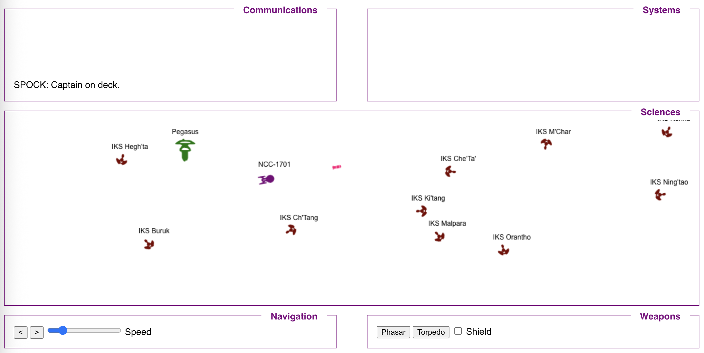
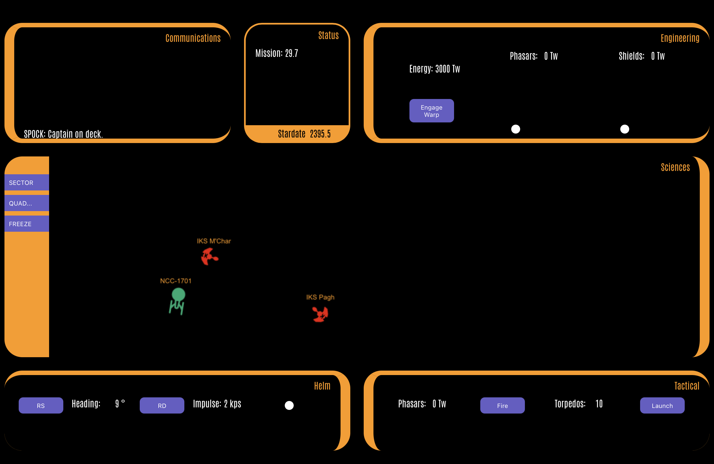

# Trek2 - The Next One!

This version of the game replaces React with vanilla Javascript and the Entity-Component-System pattern.

UI elements were broken out to a CSS file that is distributed via CDN **jsdelivr**.

- [Trek2](https://dennisdunn.github.io/trek2/)
- [Protokuda CSS Library](https://dennisdunn.github.io/protokuda/)